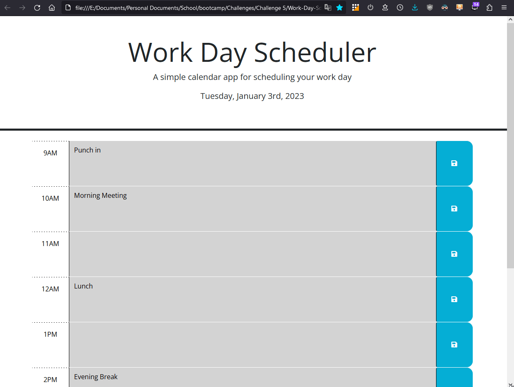

# Work-Day-Scheduler

## Description

The purpose of this program is the provide a simple work calendar that stores persistant text to the user's web browser so that it can be accessed later. Dayjs is used to display the current date at the top of the page, as well as dynamically color the different time blocks on the page according to past, present, and future.

This program utilizes different web development aspects such as: jQuery (Event Listeners, Callbacks), Bootstrap (Modals), dayjs (Plugins), localStorage 

## Link

This is a link to the project hosted on GitHub Pages: 

## Usage

This image is an example of what to expect when viewing the complete webpage.

